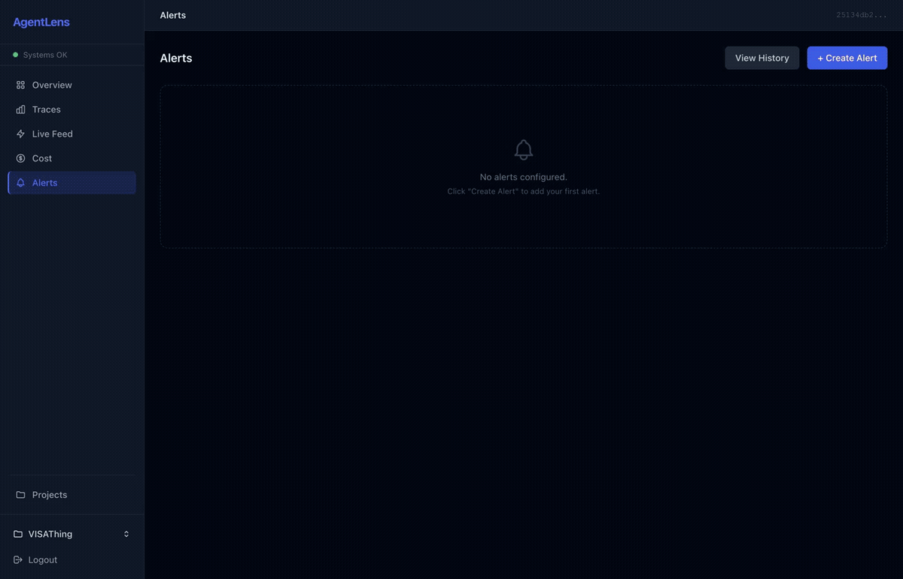
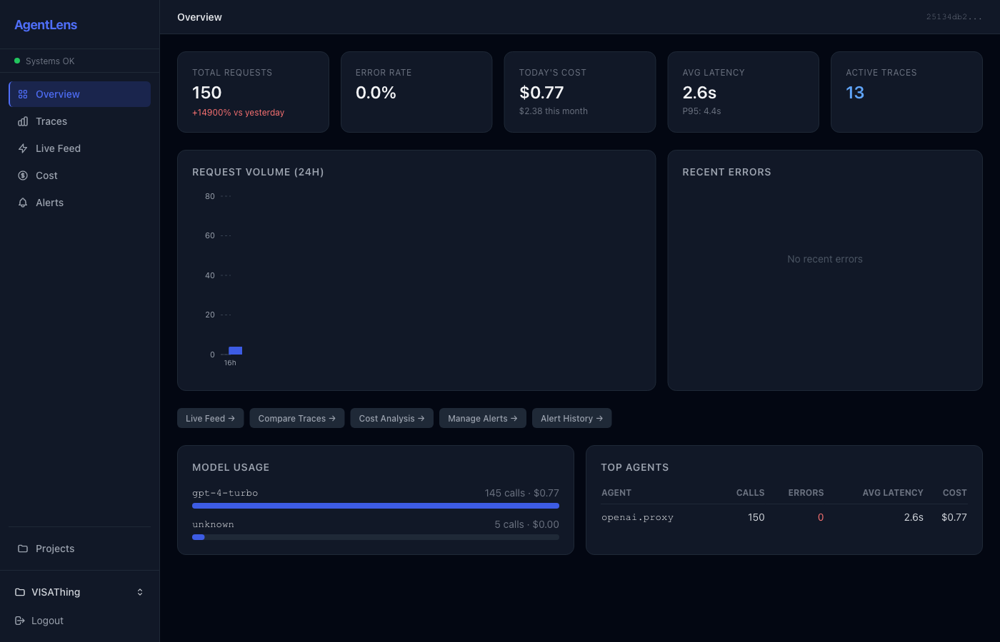
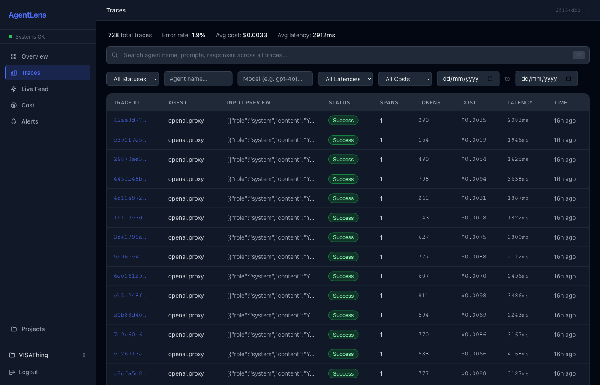
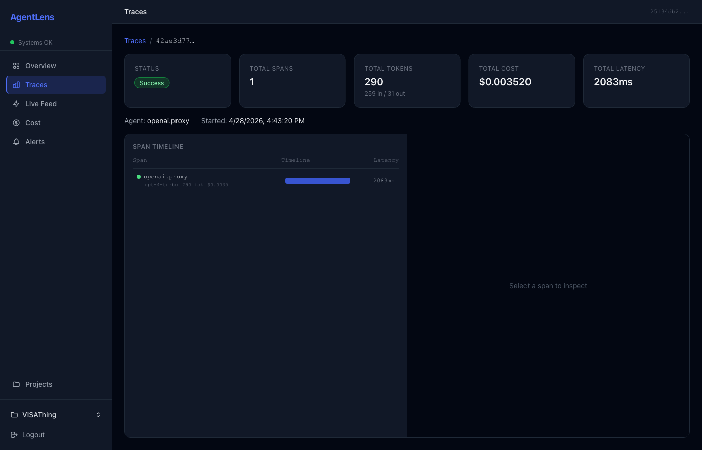
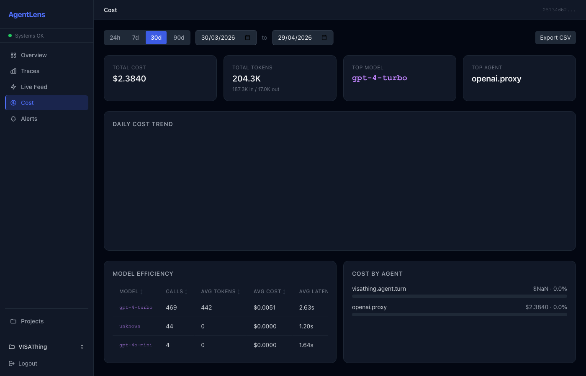

<div align="center">

```
    _                    _   _
   / \   __ _  ___ _ __ | |_| |    ___ _ __  ___
  / _ \ / _` |/ _ \ '_ \| __| |   / _ \ '_ \/ __|
 / ___ \ (_| |  __/ | | | |_| |__|  __/ | | \__ \
/_/   \_\__, |\___|_| |_|\__|_____\___|_| |_|___/
        |___/
```

**Open-source observability for AI agents**

See every LLM call, what it cost, and why it failed — without changing your code.

[](https://www.npmjs.com/package/@farzanhossans/agentlens)
[](LICENSE)
[](#)
[](#)
[](https://discord.gg/agentlens)

</div>

<div align="center">



</div>

---

## Why AgentLens?

You're building AI agents that make dozens of LLM calls per session. Something breaks in production. You have no idea which call failed, how much it cost, or what the model actually said.

AgentLens fixes that. Drop in `@farzanhossans/agentlens` once at app startup and every LLM call is traced automatically — costs, errors, full input/output, and session replay — **without changing the call sites in your application code**.

---

## How It Works

Two ways to integrate, from one line of code to full control:

### Option 1: Universal SDK — one line, every provider ⭐

Drop in `@farzanhossans/agentlens` and every call to OpenAI, Anthropic, Gemini, Cohere, or Mistral is traced automatically. No client wrappers. No code changes inside your call sites.

```typescript
// ☁️ Cloud hosted (default)
import { AgentLens } from '@farzanhossans/agentlens'
AgentLens.init({ apiKey: 'proj_xxx' })

// 🖥️ Self-hosted — point at your own ingest endpoint
AgentLens.init({
  apiKey: 'proj_xxx',
  endpoint: 'https://agentlens.your-company.com/v1/spans',
})
```

Patches `globalThis.fetch` and Node's `http`/`https` so every matching LLM call is captured — including axios, got, node-fetch, and any provider SDK. Streaming responses are tapped via `ReadableStream.tee()` so the bytes you read are byte-identical to the original. PII (emails, keys, SSNs, cards, IPs) is scrubbed before spans leave your process.

| Provider  | Captured                                       |
| --------- | ---------------------------------------------- |
| OpenAI    | chat.completions, completions, embeddings      |
| Anthropic | messages                                       |
| Gemini    | generateContent (v1, v1beta)                   |
| Cohere    | chat (v1, v2), generate                        |
| Mistral   | chat.completions                               |

### Option 2: Manual tracing (full control)

For complex agent flows where you want to name spans, add metadata, or create parent/child hierarchies:

```typescript
const result = await AgentLens.trace('classify-intent', async (span) => {
  span.setInput(JSON.stringify({ userMessage }))
  span.setMetadata('userId', user.id)

  const res = await openai.chat.completions.create({
    model: 'gpt-4o',
    messages: [{ role: 'user', content: userMessage }],
  })

  span.setOutput(res.choices[0].message.content ?? '')
  return res
})
```

Nested `AgentLens.trace()` calls are automatically linked as parent/child spans.

---

## What You Get

### Overview Dashboard
At-a-glance metrics: total requests, error rate, cost, latency, and active traces. Model usage breakdown and top agents.



### Trace Viewer
Full input/output timeline for every span in your agent run. See exactly what the model received and what it returned, with parent/child hierarchy.





### Cost Analytics
Token usage and dollar cost broken down by model, agent, and date. Instant aggregations across millions of spans powered by Elasticsearch. Monthly budget tracking with alerts.



### Error Clustering
Similar failures are auto-grouped with count badges and affected models. Spot patterns instantly instead of scrolling through logs. Powered by Elasticsearch `significant_terms` analysis.

### Full-Text Search
Search across all LLM prompts, completions, and agent names. Elasticsearch indexes every input/output with fuzzy matching — find the trace you need in seconds.

### Failure Alerts
Get notified via Slack, email, or webhook the moment something goes wrong:
- **Error rate** spikes above threshold
- **Cost** exceeds budget in a time window
- **P95 latency** crosses SLA
- **Failure count** hits limit

Real-time metric evaluation via Elasticsearch. Alert history with delivery status tracking. Test notifications before going live.

### Live Feed
Real-time trace stream via WebSocket. Watch agent calls as they happen.

### Session Replay
Step through any past agent run exactly as it happened. Group traces by session to see multi-turn conversations.

### Data Lifecycle Management
Automatic index lifecycle management with hot/warm/cold/delete phases. Per-project retention policies configurable from the dashboard (1–365 days). Old data is cleaned up automatically.

### PII Scrubbing
Emails, API keys, SSNs, and credit card numbers are auto-masked before data leaves your infrastructure. GDPR ready.

### System Health Monitoring
Sidebar indicator shows Elasticsearch status in real-time. When ES is unavailable, all analytics automatically fall back to PostgreSQL — zero downtime.

---

## Self-Hosting

Everything runs with a single `docker compose` command. No third-party accounts needed — no Vercel, no Cloudflare, no managed services.

```bash
git clone https://github.com/farzanhossan/agentlens
cd agentlens/infra
cp .env.prod.example .env
# Generate secrets: openssl rand -hex 32  →  paste into JWT_SECRET and HMAC_SECRET
docker compose -f docker-compose.prod.yml up -d --build
```

| Service | URL |
|---------|-----|
| Dashboard | http://localhost:4021 |
| API | http://localhost:4020 |

**Requirements:** Docker, 4 GB RAM.

The stack includes PostgreSQL, Redis, Elasticsearch, the API, and dashboard — all containerised.

See [docs/deployment.md](./docs/deployment.md) for custom domains, SSL, backups, monitoring, and production hardening.

### Development setup

```bash
git clone https://github.com/farzanhossan/agentlens
cd agentlens
cp apps/api/.env.example apps/api/.env   # fill in secrets
docker compose -f infra/docker-compose.yml up -d
pnpm install && pnpm dev
```

---

## Architecture

```
Your App
  │
  │  Option A: import @farzanhossans/agentlens (1 line, network-layer)
  │  Option B: manual AgentLens.trace() for custom spans
  ▼
AgentLens SDK
  │
  │  POST /v1/spans  (batched, gzip-compressed)
  ▼
NestJS API                        ← BullMQ async processing
  │
  ├──► PII Scrubber               ← masks sensitive data
  ├──► Cost Calculator             ← per-model pricing tables
  ├──► Alert Engine                ← evaluates thresholds, sends notifications
  │
  ├──► PostgreSQL                  ← traces, spans, alerts, users, projects
  └──► Elasticsearch               ← full-text search, aggregations, error clustering
        │                             (ILM: hot → warm → cold → delete)
        └──► PG fallback             ← auto-failover when ES is unavailable

React Dashboard                   ← trace viewer, cost charts, live feed, alerts
  │
  └──► WebSocket (Socket.io)       ← real-time trace updates
```

---

## SDK Packages

| Package | Description | Install |
|---------|-------------|---------|
| [`@farzanhossans/agentlens`](./packages/sdk-universal) | **Universal SDK ⭐ — one line, every provider** (OpenAI, Anthropic, Gemini, Cohere, Mistral). Network-layer interception via fetch + Node http/https patching | `npm i @farzanhossans/agentlens` |
| [`@farzanhossans/agentlens-core`](./packages/sdk-core) | Core tracer — manual spans, context propagation | `npm i @farzanhossans/agentlens-core` |
| [`@farzanhossans/agentlens-openai`](./packages/sdk-openai) | Provider-specific: auto-patches the OpenAI SDK (chat, completions, embeddings) | `npm i @farzanhossans/agentlens-openai` |
| [`@farzanhossans/agentlens-anthropic`](./packages/sdk-anthropic) | Provider-specific: auto-patches the Anthropic SDK | `npm i @farzanhossans/agentlens-anthropic` |
| [`agentlens`](./packages/sdk-python) | Python SDK with decorators + auto-patchers | `pip install agentlens` |

---

## What Gets Captured

**Per LLM call (span):**

| Metric | Source |
|--------|--------|
| Input/output tokens | LLM response headers |
| Cost (USD) | Built-in pricing tables (OpenAI, Anthropic) |
| Latency | Request start → response end |
| Status | success / error / timeout |
| Model + provider | Parsed from request |
| Full prompt + completion | Stored in Elasticsearch (PII-scrubbed) |
| Error message | Captured on failure |
| Custom metadata | Your key-value pairs |

**Per trace (agent run):**

| Metric | Description |
|--------|-------------|
| Total spans | Number of LLM calls in the run |
| Total tokens | Sum across all spans |
| Total cost | Sum across all spans |
| Total latency | End-to-end duration |
| Agent name | Identifier for the agent |
| Session ID | Group multi-turn conversations |
| Span hierarchy | Parent/child relationships |

---

## Tech Stack

| Layer | Tech |
|-------|------|
| Backend | NestJS, Fastify, TypeORM, BullMQ |
| Frontend | React 18, Vite, Recharts, TailwindCSS |
| Proxy | Hono (Node.js) |
| Database | PostgreSQL + Elasticsearch + Redis |
| SDKs | TypeScript (Node + browser), Python |
| Auth | JWT + bcrypt |
| Real-time | Socket.io (WebSocket) |
| Build | pnpm workspaces, Turborepo, tsup |

---

## Contributing

We welcome PRs. See [CONTRIBUTING.md](./CONTRIBUTING.md) for the full guide.

```bash
git clone https://github.com/YOUR_USERNAME/agentlens
pnpm install
pnpm test       # 81 tests across all packages
pnpm lint       # ESLint + Prettier
```

---

## Roadmap

- [x] Elasticsearch-powered aggregations and analytics
- [x] Error clustering and pattern detection
- [x] Full-text search across prompts and completions
- [x] Index lifecycle management (ILM) with rolling indices
- [x] Per-project data retention policies
- [x] Proxy trace grouping via optional headers
- [ ] LangChain auto-patcher
- [ ] LlamaIndex auto-patcher
- [ ] Prompt versioning and diffing
- [ ] A/B testing for prompts
- [ ] Cost budgets with auto-shutoff
- [ ] Multi-region support

---

## License

[MIT](./LICENSE) — free for personal and commercial use.

---

<div align="center">

Built by [Farzan Hossan](https://github.com/farzanhossan)

</div>
